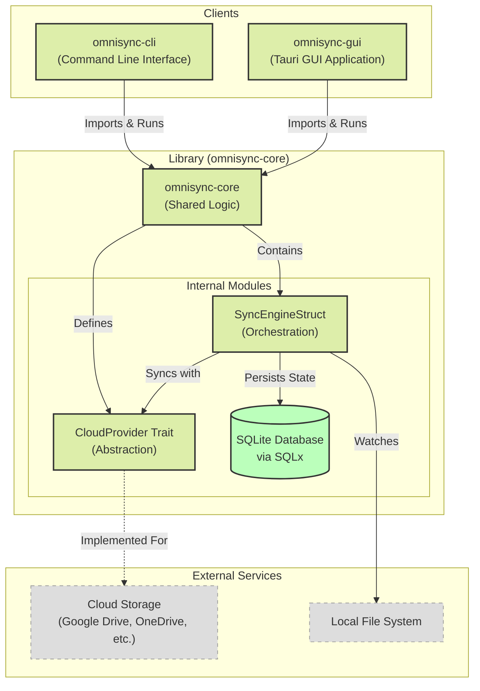

# OmniSync-Engine

A high-performance, cross-platform file synchronization service built with Rust.

## Components

- **omnisync-core**: The library containing the synchronization logic and database models.
- **omnisync-cli**: A command-line interface for the engine.
- **omnisync-gui**: A Tauri-based graphical user interface.

## Prerequisites

- [Rust](https://www.rust-lang.org/tools/install) (latest stable)
- System dependencies for Tauri (see [Tauri Setup Guide](https://tauri.app/v1/guides/getting-started/prerequisites))

### Linux Dependencies
```bash
sudo apt-get update
sudo apt-get install libwebkit2gtk-4.0-dev \
    build-essential \
    curl \
    wget \
    file \
    libssl-dev \
    libgtk-3-dev \
    libayatana-appindicator3-dev \
    librsvg2-dev
```

## Getting Started

### 1. Build the Project

```bash
cargo build
```

### 2. Run Integration Tests

```bash
cargo test -p omnisync-core
```

### 3. Run the CLI

To start the sync engine (requires a path to a SQLite database file, which will be created if it doesn't exist):

```bash
cargo run -p omnisync-cli -- --db-path ./omnisync.db
```

### 4. Run the GUI

```bash
cargo tauri dev
# OR if you want to run specifically the gui package context
cd omnisync-gui
cargo tauri dev
```

## Architecture

The project is structured as a Cargo Workspace with a shared library (`omnisync-core`) and two consumers (`omnisync-cli` and `omnisync-gui`).



## Sync Flow & Mechanisms

### 1. Initialization
- **Engine Startup**: The `SyncEngine` initializes the SQLite connection pool and runs pending migrations.
- **Provider Registry**: Cloud providers (e.g., Google Drive, OneDrive) are registered implementing the `CloudProvider` trait.
- **Watcher Setup**: The engine loads active `sync_pairs` from the database and registers their local paths with the `notify` watcher.

### 2. Change Detection (Local -> Cloud)
1.  **Event Capture**: The `FilesystemWatcher` listens for OS-level file events (`Create`, `Modify`, `Remove`, `Rename`).
2.  **Event Loop**: `SyncEngine` polls these events in a non-blocking loop.
3.  **Processing** (Planned):
    - **Debouncing**: Short-term events are aggregated to prevent rapid-fire uploads.
    - **Filtering**: Files matching `.syncignore` patterns are discarded.
    - **Hashing**: Calculating file hashes to detect content changes versus metadata-only changes.
4.  **Transfer**: The valid event triggers a `CloudProvider::upload_file` call.
5.  **State Update**: Upon success, the `files` table is updated with the new hash and timestamp.

### 3. Change Detection (Cloud -> Local) (Planned)
1.  **Polling/Webhook**: The engine periodically polls the cloud provider for a "changes" or "delta" token.
2.  **Reconciliation**: Incoming changes are compared against the local database state.
3.  **Conflict Resolution**:
    - **Last Write Wins**: Default strategy based on timestamps.
    - **Conflict Copy**: Renaming local files if a remote conflict occurs.

## Data Models

- **SyncPair**: Represents a mapping between a `local_path` and a `remote_path` for a specific `provider_id`.
- **Files Table**: Tracks the state of every synced file (path, hash, size, modified_at) to enable differential sync.

