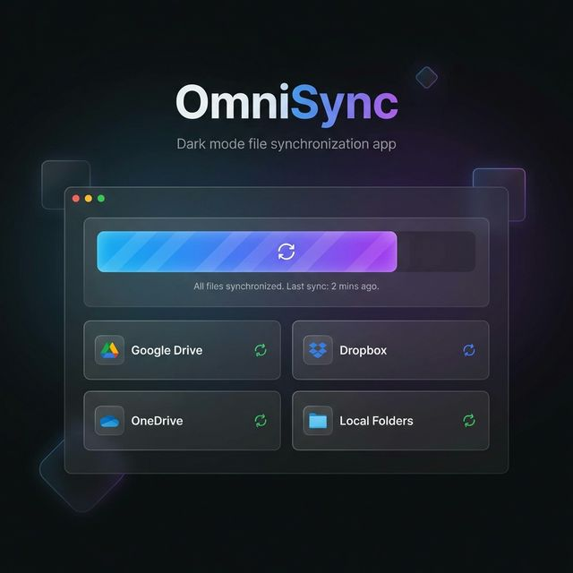
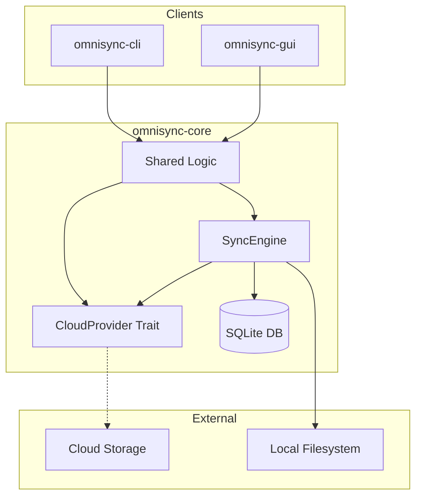

# OmniSync

<p align="center">
  
</p>

## Your Files, Everywhere, Instantly.

OmniSync is a next-generation, high-performance file synchronization service that bridges the gap between your local devices and the cloud. Built with **Rust** for uncompromising speed and reliability, OmniSync offers a premium experience for managing your digital life.

---

### ✨ Key Features

- 🚀 **Lightning Fast Sync**: Leveraging Rust's performance to handle thousands of files with minimal overhead.
- ☁️ **Multi-Cloud Integration**: Native support for Google Drive (with OneDrive and Dropbox coming soon).
- 🛡️ **Privacy First**: Your sync state is stored locally in a secure SQLite database. We don't track your data.
- 💻 **Cross-Platform**: Seamlessly works across macOS, Linux, and Windows.
- 🔄 **Real-time Detection**: Instant file change detection using advanced filesystem watching technology.
- 🎨 **Beautiful Interface**: A modern, glassmorphic GUI designed for clarity and ease of use.

---

### 🛠️ Components

The OmniSync ecosystem consists of three main modules:

1.  **OmniSync Core**: The powerhouse library containing all synchronization logic.
2.  **OmniSync CLI**: For power users who prefer the speed of the command line.
3.  **OmniSync Desktop**: A stunning Tauri-based graphical interface for everyone.

---

### 🚀 Getting Started

OmniSync is fully cross-platform. You can build it locally for your current OS or use our automated CI/CD for distribution.

#### Prerequisites
- [Rust](https://www.rust-lang.org/tools/install) (latest stable)
- System dependencies:
  - **macOS**: None (standard Xcode tools recommended)
  - **Linux**: See the [Tauri Linux guide](https://tauri.app/v1/guides/getting-started/prerequisites#linux) for required packages (GTK, WebKit2Gtk, etc.)
  - **Windows**: [WebView2](https://developer.microsoft.com/en-us/microsoft-edge/webview2/) (usually pre-installed)

#### Build Locally
1. **Clone the repository**
   ```bash
   git clone https://github.com/pxbao-itus/omnisync.git
   cd omnisync
   ```

2. **Launch the Desktop App**
   ```bash
   # Start in development mode
   make dev
   
   # Or build a production installer for your current OS
   make build
   ```

---

### 📦 Automated Releases

We use **GitHub Actions** to automatically build and package OmniSync for **Windows (.msi, .exe)**, **macOS (.dmg, .app)**, and **Linux (.AppImage, .deb)**.

- **CI/CD**: Every tag push (e.g., `v0.1.0`) triggers a matrix build across all three major operating systems.
- **Artifacts**: Download the ready-to-run binaries from the [GitHub Releases](https://github.com/pxbao-itus/omnisync/releases) page.

---

### 🏗️ For Developers

OmniSync is built with a modular architecture in Mind.


```mermaid
graph TD
    subgraph Clients
        CLI[omnisync-cli]
        GUI[omnisync-gui]
    end

    subgraph "omnisync-core"
        Core[Shared Logic]
        Engine[SyncEngine]
        Provider[CloudProvider Trait]
        DB[(SQLite DB)]
    end

    subgraph "External"
        Cloud[Cloud Storage]
        FS[Local Filesystem]
    end

    CLI --> Core
    GUI --> Core
    Core --> Engine
    Core --> Provider
    Engine --> DB
    Engine --> FS
    Engine --> Provider
    Provider -.-> Cloud
```

#### Running Tests
```bash
cargo test -p omnisync-core
```

---

<p align="center">
  Built with ❤️ by the OmniSync Team.
</p>


